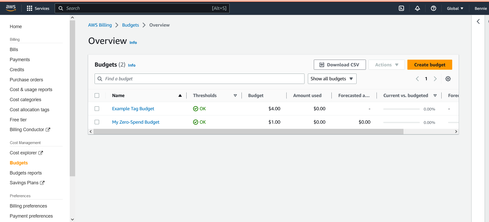

# Week 0 — Billing and Architecture

## Getting the AWS CLI working

 I installed the AWS CLI using gitpod environment and saved the configuration file in the gitpod.yaml file.
Created a new user and generated AWS credentials for the user by:

- Navigating to the IAM USERS Console and enabling access for the user.
- Created an Admin group and gave it an AdministratorAccess or priviledge.
- Created the user and added the user to the Admin group.
- Clicked on Security Credentials and generated Access key.
- Then used the AWS CLI Access.
- Downloaded the CSV with the credentials.
Created both a Billing Alert and AWS Budget.

Then using Lucid charts recreated Cruddur Conceptual Diagram and Cruddur Logical Diagram as shown below:

## Recreated Cruddur Conceptual Diagram

[Lucid Chart Share Link](https://lucid.app/lucidchart/32e9d2d4-e003-439a-9446-27ac60020ef5/edit?viewport_loc=-82%2C-10%2C1969%2C931%2C0_0&invitationId=inv_e718efa7-8c15-447c-bb3c-eafeb1a780f3)

## Recreated Cruddur Architectural Logical Diagram

[Lucid Chart Share Link](https://lucid.app/lucidchart/dd559879-66f9-432e-93ae-a83424653807/edit?viewport_loc=-786%2C-388%2C2622%2C1240%2C0_0&invitationId=inv_455c05bb-548e-4bfb-a985-05a677063bf8)

Though i could not create the Momento (Severless Caching) due to the fact that it required upgrading my free account in order to enable it allow a premium feature as shown below:

## Aws Budget
I created a Zero-spend-budget which notifies me whenever i excced my free tier limit using Chirag's video but also went further to do so using Andrew's video to create another using Cmmand line Interface (CLI).

## Creating a Billing Alarm
In order to create this, a Simple Notification Service (SNS) topic is needed because it is what will send me an alert when I get overbilled. I was able to do this using the following command:

`aws sns create-topic --name billing-alarm`

This command will then return a TopicARN. Then I created a subscription and inputted the TopicARN and my email which I hid because they are sensitive information and as such should not be exposed. The following command was used to create the subscription:

`aws sns subscribe \`

    `--topic-arn TopicARN \`
    
    `--protocol email \`
    
    `--notification-endpoint your@email.com`
    

   
   To create the alarm, i updated the configuration json script with the TopicARN I generated earlier then i ran the following command:
   
   `aws cloudwatch put-metric-alarm --cli-input-json file://aws/json/alarm_config.json`
   
   This created the alarm after which i was sent an email to confirm my subscription which i did.
   

