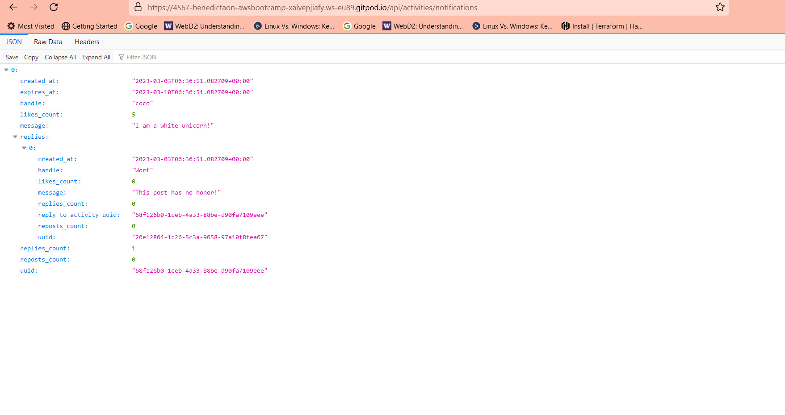
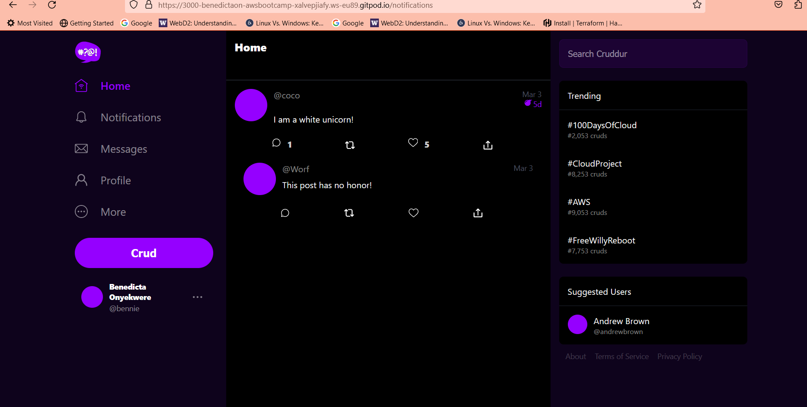
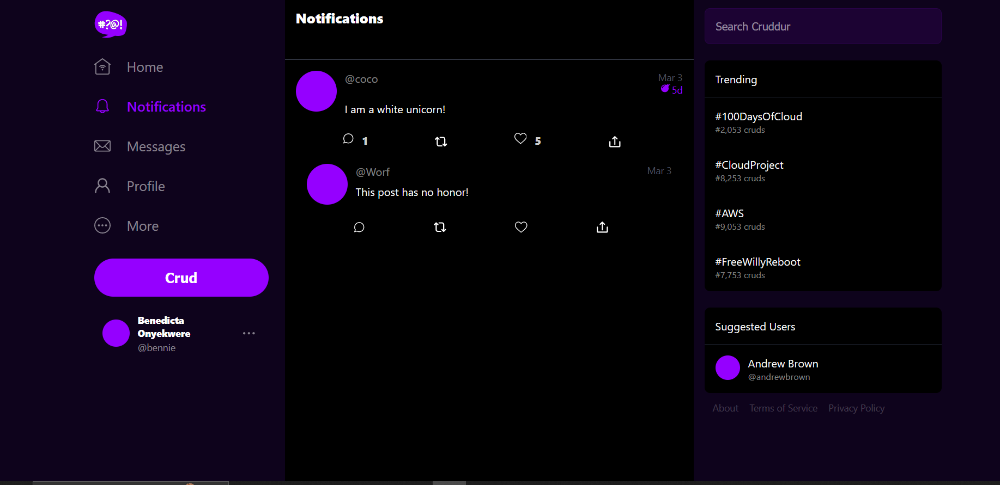
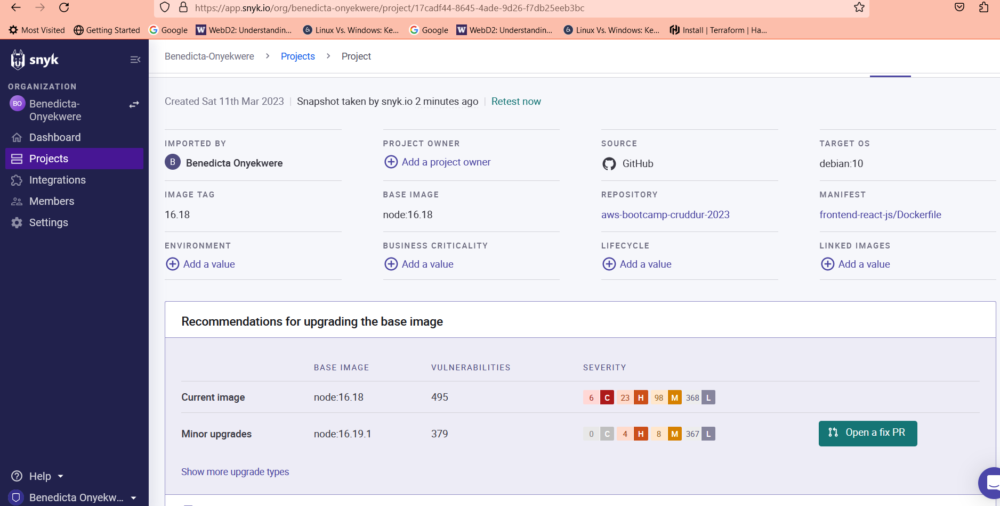
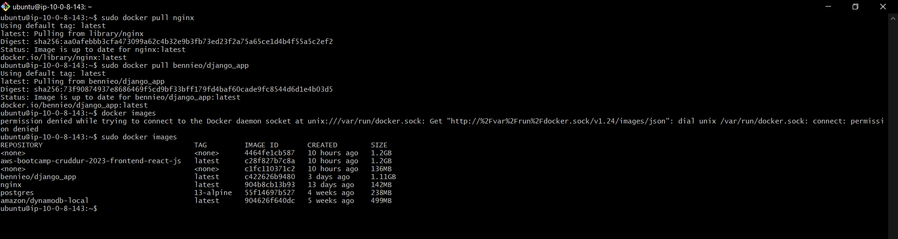
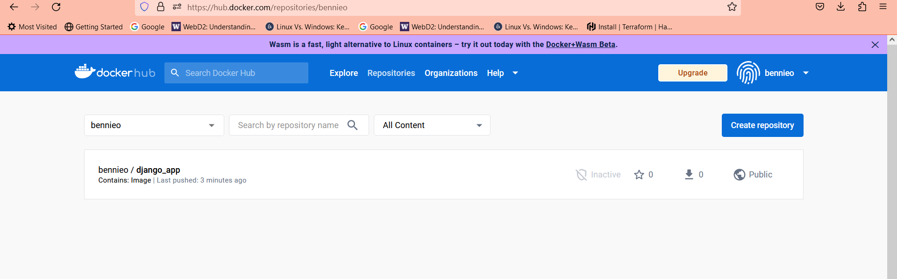
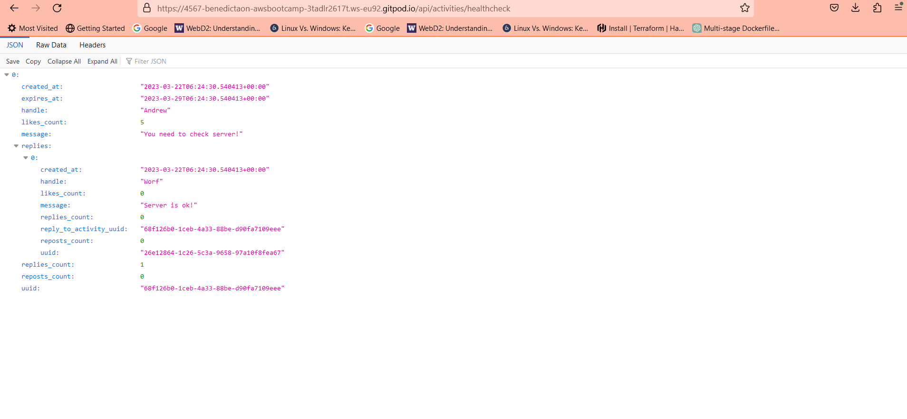

# Week 1 — App Containerization

## Containerize Backend
This is done by running the following Python commands locally;
```
cd backend-flask
export FRONTEND_URL="*"
export BACKEND_URL="*"
python3 -m flask run --host=0.0.0.0 --port=4567
cd ..
```


Then I opened the link for port 4567 in a browser with /api/activities/home appended to it, where i got back the contents of the json file.

## Add Dockerfile
Started by creating a Dockerfile in the backend-flask that is backend-flask/Dockerfile and then copied and paste the following commands:
```
FROM python:3.10-slim-buster

# Inside Container
# Make a new folder inside
WORKDIR /backend-flask

# From outside container -> Inside container
# This contains libraries to be installed to run the app
COPY requirements.txt requirements.txt

# Inside Contianer
# Install the python libraries used for the app
RUN pip3 install -r requirements.txt

# Copy from outside container -> Inside
# . means everything in the current directory
# first period . -/backend-flask(outside container)
# second period . /backend-flask(inside container)
COPY . .

# Set Environment variables(Env Vars)
# Inside conatainer and will remain set when the container is run 
ENV FLASK_ENV=development


EXPOSE ${PORT}

# CMD(Command to run flask)
# python3 -m flask run --host=0.0.0 --port=4567
CMD [ "python3", "-m" , "flask", "run", "--host=0.0.0.0", "--port=4567"]
```

## Build Container
I ran the following command to create the image.

`docker build -t frontend-react-js ./frontend-react-js`

## Run Container
I ran the container using the command;

`docker run --rm -p 4567:4567 -it -e FRONTEND_URL='*' -e BACKEND_URL='*' backend-flask`

Run in background
To run container in the background while i can continue working, this command is used;

`docker container run --rm -p 4567:4567 -d backend-flask`


## Get Container Images or Running Container Ids
Then i ran the following commands to see the running process in the container and get the container Id and also to see the images that have been created as well.

`docker ps`

`docker images`


## Containerize Frontend
To do this i did the following;
- cd frontend-react-js
- Installed npm using the command npm i. Npm install has to be done before building the container since it needs to copy the contents of node_modules.
- Created a Dockerfile with the following contents;
```
FROM node:16.18

ENV PORT=3000

COPY . /frontend-react-js
WORKDIR /frontend-react-js
RUN npm install
EXPOSE ${PORT}
CMD ["npm", "start"]
```

- Ran the build and run commands respectively;

## Build Container

`docker build -t frontend-react-js ./frontend-react-js`

## Run Container

`docker run -p 3000:3000 -d frontend-react-js`
 
 ## Multiple Containers
 To orchestrate multiple containers that have to work together locally, a docker-compose file is used to achieve this.

Created a docker-compose.yml at the root of my project.
```
version: "3.8"
services:
  backend-flask:
    environment:
      FRONTEND_URL: "https://3000-${GITPOD_WORKSPACE_ID}.${GITPOD_WORKSPACE_CLUSTER_HOST}"
      BACKEND_URL: "https://4567-${GITPOD_WORKSPACE_ID}.${GITPOD_WORKSPACE_CLUSTER_HOST}"
    build: ./backend-flask
    ports:
      - "4567:4567"
    volumes:
      - ./backend-flask:/backend-flask
      healthcheck:
      test: ["CMD-SHELL", "curl --fail http://localhost:4567/health || exit 1"]
      interval: 30s
      timeout: 10s
      retries: 3
      
  frontend-react-js:
    environment:
      REACT_APP_BACKEND_URL: "https://4567-${GITPOD_WORKSPACE_ID}.${GITPOD_WORKSPACE_CLUSTER_HOST}"
    build: ./frontend-react-js
    ports:
      - "3000:3000"
    volumes:
      - ./frontend-react-js:/frontend-react-js
      healthcheck:
      test: ["CMD-SHELL", "curl --fail http://localhost:3000/health || exit 1"]
      interval: 30s
      timeout: 10s
      retries: 3
      

# the name flag is a hack to change the default prepend folder
# name when outputting the image names
networks: 
  internal-network:
    driver: bridge
    name: cruddur
   

   ```
   
   
   
   


## Creating a Backend Notification feature (Backend and Frontend)
### Adding an endpoint to the notifications tab Backend:
- In the backend-flask added a new path that is notifications in the openapi i.e **/api/activities/notifications**.
- Added a get request.
- Defined a new end endpoint in app.py file.
- Created a **notifications_acitivities.py** file just as the other rail services so they are all microservices.
- Copied contents/data into the **notifications_activities.py** file.
- Copied the 4567 port url to a browser, got an error code, fixed and resolved it.
- Got a 404 error code which is ok.
- Copied and appended the **/api/activities/notifications** and the backend code worked.





### Implement Frontend Notifications Page
- In the Frontend-react.js file, went to the entrypoint which is the **app.js** file.
- Created a new page **NotificationsFeedPage** to the other existing pages.
- Added its path to the Browser Router.
- Created a file named **NotificationsFeedPage.js**
- Copied and paste content into the file.
- Made sure in the DesktopNavigation.js file that the notifications link has been synced/linked.
- The Frontend notifications worked but later adjusted it from the title being highlighted as Home to Notifications Page.





-  


## Adding DynamoDB Local and Postgres
Since we are going to use Postgres and DynamoDB local in future labs, they can be brought back in as containers and reference them externally

Integrating the following into my existing docker compose file:

## Postgres
```
services:
  db:
    image: postgres:13-alpine
    restart: always
    environment:
      - POSTGRES_USER=postgres
      - POSTGRES_PASSWORD=password
    ports:
      - '5432:5432'
    volumes: 
      - db:/var/lib/postgresql/data
volumes:
  db:
    driver: local
```

To work with Postgres need to have the drivers installed. To install Postgres client into Gitpod, the following code is used:
```
  - name: postgres
    init: |
      curl -fsSL https://www.postgresql.org/media/keys/ACCC4CF8.asc|sudo gpg --dearmor -o /etc/apt/trusted.gpg.d/postgresql.gpg
      echo "deb http://apt.postgresql.org/pub/repos/apt/ `lsb_release -cs`-pgdg main" |sudo tee  /etc/apt/sources.list.d/pgdg.list
      sudo apt update
      sudo apt install -y postgresql-client-13 libpq-dev
       
   ```
 
  ## DynamoDB Local  
  ```
  services:
  dynamodb-local:
    # https://stackoverflow.com/questions/67533058/persist-local-dynamodb-data-in-volumes-lack-permission-unable-to-open-databa
    # We needed to add user:root to get this working.
    user: root
    command: "-jar DynamoDBLocal.jar -sharedDb -dbPath ./data"
    image: "amazon/dynamodb-local:latest"
    container_name: dynamodb-local
    ports:
      - "8000:8000"
    volumes:
      - "./docker/dynamodb:/home/dynamodblocal/data"
    working_dir: /home/dynamodblocal
   ```
  ## Homework Challenges
  ### Run the dockerfile CMD as an external script.
  
To do this i created a bashscript file in the backend-flask named run_flask.sh and added the following script:
```
#!/bin/sh

python3 -m flask run --host=0.0.0.0 --port=4567
```
Then added an Entrypoint instead of CMD and then included the path to the scrpit but I first made the script executable using the following command:

`RUN chmod +x /backend-flask/run_flask.sh`

`ENTRYPOINT [ "/backend-flask/run_flask.sh" ]`

### Research best practices of Dockerfiles and attempt to implement it in your Dockerfile
I implemented some of the best Dockerfile practices i researched in my dockerfile such as:
- Setting a non-root user because running processes as root can lead to vulnerabilities. I used the User command to set this as follows:

`RUN useradd -ms /bin/bash myuser
USER myuser`

- I cleaned up after the installation instructions because cleaning up after each instruction is a best practice to minimize the size of a Docker image.I implemented this by using the following command in order to remove unnecessary files and packages after installing them, and delete temporary files and directories.

`RUN apt-get autoremove -y && apt-get clean && rm -rf /var/lib/apt/lists/* /tmp/* /var/tmp/*`

- I signed up with Synk OpenSource Security and imported my repository so it can check for vulnerabilities and help fix them.



- I hid sensitive data in my docker compose file like the Postgres User and Postgres password in a .env file i created and also put the .env file in a gitignore file I created as well. 

### Launching an EC2 Instance and Pulling a Contaianer
To accomplish this i did the following:
- Launched and configured an AWS ec2 instance.
- SSH into the instance using the key pair and the instance's public IP address.
- Updated the system.
- Installed Docker using a bashscript from the official website  https://get.docker.com/

```

#!/usr/bin/env bash

# Step 1:
# This example downloads the script from https://get.docker.com/ and runs it to install the latest stable release of Docker on Linux:
curl -fsSL https://get.docker.com -o get-docker.sh
sudo sh get-docker.sh

# Step 2:
# Test the installation
docker -v
```
- Then I pulled the containers nginx, my own image bennieo/django etc, using the command 

`docker pull <image name>`



### Push and tag an image to DockerHub
I was able to implement this using the following steps:
- Got a Python Django application I'm currently working on.
- Dockerized my application by creating a Dockerfile and docker compose file.
- Build my application using docker compose up and debugged where necessary.
- Used a bashscript to upload my image to dockerhub.
- Added my credentials when prompted and image was then uploaded.

```
# USING BASH SCRIPT TO TAG AND UPLOAD AN IMAGE TO DOCKER HUB

#!/usr/bin/env bash

# Assumes that an image is built via `run_docker-compose.sh`

# Step 1:
# Create dockerpath
dockerpath=django_app

# Step 2:  
# Authenticate & tag
echo "Docker ID and Image: $dockerpath"
docker login -u bennieo

#Step 3:
# Tag the images with your Docker ID
docker tag $dockerpath:latest bennieo/$dockerpath

# Step 4:
# Push image to a docker repository
docker push bennieo/$dockerpath
```





### Use multi-stage building for a Dockerfile build
I created a Dockerfile

```
# Stage 1: Build the application using Node.js and NPM
FROM node:12-alpine AS build

WORKDIR /app

COPY package*.json ./

RUN npm install

COPY . .
RUN npm run build

# Stage 2: Build the final image using Nginx
FROM nginx:1.21.3-alpine

COPY --from=build /app/build /usr/share/nginx/html

EXPOSE 80
CMD ["nginx", "-g", "daemon off;"]
```

### Defining the stages in the Dockerfile
- I defined 2 stages: build and nginx.
- In the first stage (build) used `node:12-alpine` as base image
- Created a folder /app inside the container.
- Copied all package.json files(that is package.json and package-lock.json) files into the container /app folder.
- Installed all the required packages using `npm install`.
- Copied the entire application code i.e files and directories from the current directory of the host OS or machine to the /app directory of the container.
- Then ran the command `npm run buld` to build the application.
- Stage 2 involves using `nginx:1.21.3-alpine` as base image.
- Copying the build output from the build stage to the /usr/share/nginx/html directory in the final image.
- Then exposing port 80, and starting the nginx server using the CMD command.

### Implement a healthcheck in the V3 Docker compose file
- I included a healthcheck service in both the backend-flask and frontend-react.js in my docker compose file to monitor and manage the health of the containers.
- In the backend-flask added a new path that is healthcheck in the openapi i.e **/api/activities/healthcheck**.
- Added a get request.
- Defined a new end endpoint in app.py file.
- Created a **healthcheck_acitivities.py** file just as the other rail services so they are all microservices.
- Copied contents/data into the **healthcheck_activities.py** file.



### Learn how to install Docker on your localmachine and get the same containers running outside of Gitpod / Codespaces
I learnt how to do this but could not install on my localmachine because it didnt have the storage capacity needed.
 

      
