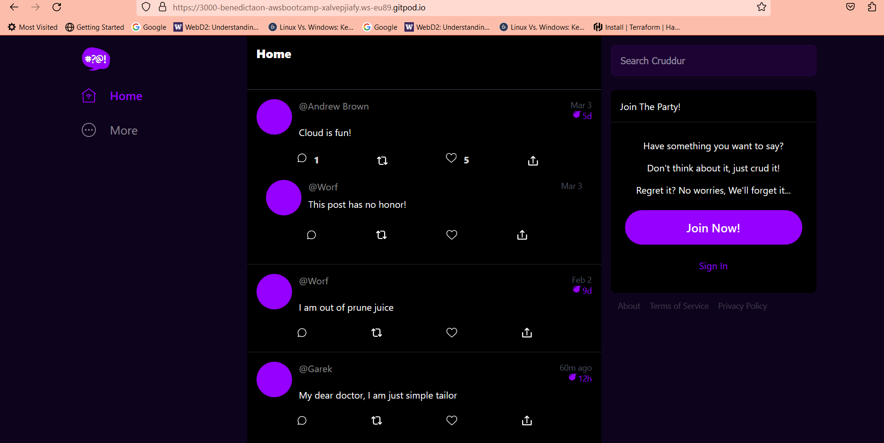

# Week 1 — App Containerization

## Containerize Backend
This is done by running the following Python commands locally;
```
cd backend-flask
export FRONTEND_URL="*"
export BACKEND_URL="*"
python3 -m flask run --host=0.0.0.0 --port=4567
cd ..
```


Then I opened the link for port 4567 in a browser with /api/activities/home appended to it, where i got back the contents of the json file.

## Add Dockerfile
Started by creating a Dockerfile in the backend-flask that is backend-flask/Dockerfile and then copied and paste the following commands:
```
FROM python:3.10-slim-buster

# Inside Container
# Make a new folder inside
WORKDIR /backend-flask

# From outside container -> Inside container
# This contains libraries to be installed to run the app
COPY requirements.txt requirements.txt

# Inside Contianer
# Install the python libraries used for the app
RUN pip3 install -r requirements.txt

# Copy from outside container -> Inside
# . means everything in the current directory
# first period . -/backend-flask(outside container)
# second period . /backend-flask(inside container)
COPY . .

# Set Environment variables(Env Vars)
# Inside conatainer and will remain set when the container is run 
ENV FLASK_ENV=development


EXPOSE ${PORT}

# CMD(Command to run flask)
# python3 -m flask run --host=0.0.0 --port=4567
CMD [ "python3", "-m" , "flask", "run", "--host=0.0.0.0", "--port=4567"]
```

## Build Container
I ran the following command to create the image.

`docker build -t frontend-react-js ./frontend-react-js`

## Run Container
I ran the container using the command;

`docker run --rm -p 4567:4567 -it -e FRONTEND_URL='*' -e BACKEND_URL='*' backend-flask`

Run in background
To run container in the background while i can continue working, this command is used;

`docker container run --rm -p 4567:4567 -d backend-flask`


## Get Container Images or Running Container Ids
Then i ran the following commands to see the running process in the container and get the container Id and also to see the images that have been created as well.

`docker ps`

`docker images`


## Containerize Frontend
To do this i did the following;
- cd frontend-react-js
- Installed npm using the command npm i. Npm install has to be done before building the container since it needs to copy the contents of node_modules.
- Created a Dockerfile with the following contents;
```
FROM node:16.18

ENV PORT=3000

COPY . /frontend-react-js
WORKDIR /frontend-react-js
RUN npm install
EXPOSE ${PORT}
CMD ["npm", "start"]
```

- Ran the build and run commands respectively;

## Build Container

`docker build -t frontend-react-js ./frontend-react-js`

## Run Container

`docker run -p 3000:3000 -d frontend-react-js`
 
 ## Multiple Containers
 To orchestrate multiple containers that have to work together locally, a docker-compose file is used to achieve this.

Created a docker-compose.yml at the root of my project.
```
version: "3.8"
services:
  backend-flask:
    environment:
      FRONTEND_URL: "https://3000-${GITPOD_WORKSPACE_ID}.${GITPOD_WORKSPACE_CLUSTER_HOST}"
      BACKEND_URL: "https://4567-${GITPOD_WORKSPACE_ID}.${GITPOD_WORKSPACE_CLUSTER_HOST}"
    build: ./backend-flask
    ports:
      - "4567:4567"
    volumes:
      - ./backend-flask:/backend-flask
  frontend-react-js:
    environment:
      REACT_APP_BACKEND_URL: "https://4567-${GITPOD_WORKSPACE_ID}.${GITPOD_WORKSPACE_CLUSTER_HOST}"
    build: ./frontend-react-js
    ports:
      - "3000:3000"
    volumes:
      - ./frontend-react-js:/frontend-react-js

# the name flag is a hack to change the default prepend folder
# name when outputting the image names
networks: 
  internal-network:
    driver: bridge
    name: cruddur
   

   ```
   
   
   
   



## Creating a Backend Notification feature (Backend and Frontend)
### Adding an endpoint to the notifications tab Backend:
- In the backend-flask added a new path that is notifications in the openapi i.e **/api/activities/notififcations**.
- Added a get request.
- Defined a new end endpoint in app.py file.
- Created a **notifications_acitivities.py** file just as the other rail services so they are all microservices.
- Copied contents/data into the **nootifications_activities.py** file.
- Copied the 4567 port url to a browser, got an error code, fixed and resolved it.
- Got a 404 error code which is ok.
- Copied and appended the **/api/ctivities/notifications** and the backend code worked.


### Implement Frontend Notifications Page
- In the Frontend-react.js file, went to the entrypoint which is the **app.js** file.
- Created a new page **NotificationsFeedPage** to the other existing pages.
- Added its path to the Browser Router.
- Created a file named **NotificationsFeedPage.js**
- Copied and paste content into the file.
- Made sure in the DesktopNavigation.js file that the notifications link has been synced/linked.
- The Frontend notifications worked but later adjusted it from the title being highlighted as Home to Notifications Page.


-  


## Adding DynamoDB Local and Postgres
Since we are going to use Postgres and DynamoDB local in future labs, they can be brought back in as containers and reference them externally

Integrating the following into my existing docker compose file:

## Postgres
```
services:
  db:
    image: postgres:13-alpine
    restart: always
    environment:
      - POSTGRES_USER=postgres
      - POSTGRES_PASSWORD=password
    ports:
      - '5432:5432'
    volumes: 
      - db:/var/lib/postgresql/data
volumes:
  db:
    driver: local
```

To work with Postgres need to have the drivers installed. To install Postgres client into Gitpod, the following code is used:
```
  - name: postgres
    init: |
      curl -fsSL https://www.postgresql.org/media/keys/ACCC4CF8.asc|sudo gpg --dearmor -o /etc/apt/trusted.gpg.d/postgresql.gpg
      echo "deb http://apt.postgresql.org/pub/repos/apt/ `lsb_release -cs`-pgdg main" |sudo tee  /etc/apt/sources.list.d/pgdg.list
      sudo apt update
      sudo apt install -y postgresql-client-13 libpq-dev
       
   ```
 
  ## DynamoDB Local  
  ```
  services:
  dynamodb-local:
    # https://stackoverflow.com/questions/67533058/persist-local-dynamodb-data-in-volumes-lack-permission-unable-to-open-databa
    # We needed to add user:root to get this working.
    user: root
    command: "-jar DynamoDBLocal.jar -sharedDb -dbPath ./data"
    image: "amazon/dynamodb-local:latest"
    container_name: dynamodb-local
    ports:
      - "8000:8000"
    volumes:
      - "./docker/dynamodb:/home/dynamodblocal/data"
    working_dir: /home/dynamodblocal
    
  
      
