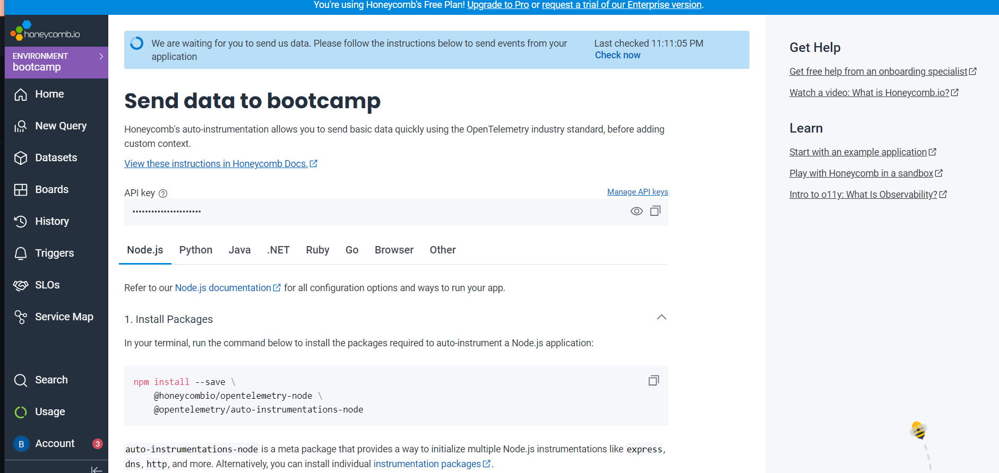
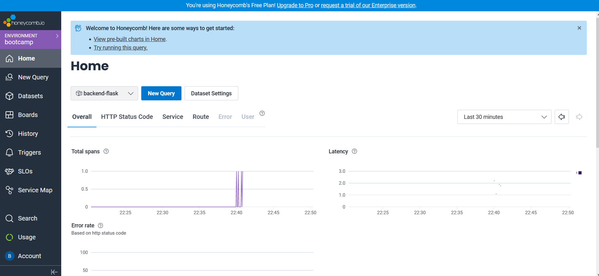
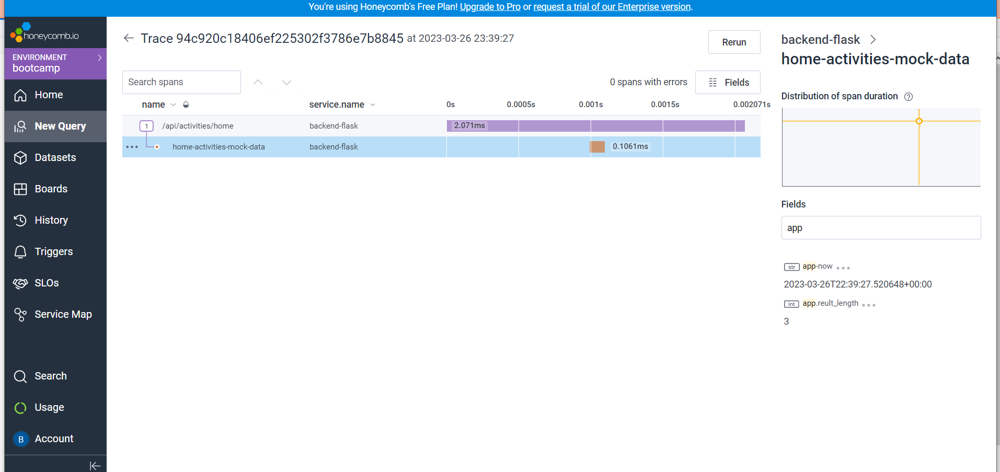

# Week 2 — Distributed Tracing
## Insrumenting Honeycomb for Flask
- Started by first logging into my honeycomb account.
- Created Environment and copied API keys.




- Added API keys to Environment Variable in my Cloud Environment.
```
export HONEYCOMB_API_KEY=""
gp env HONEYCOMB_API_KEY=""
export HONEYCOMB_SERVICE_NAME="Cruddur"
gp env HONEYCOMB_SERVICE_NAME="Cruddur"
```
- Configured Open Telemetry(OTEL) service, endpoint and headers into backend-flask.
```
OTEL_EXPORTER_OTLP_ENDPOINT: "https://api.honeycomb.io"
OTEL_EXPORTER_OTLP_HEADERS: "x-honeycomb-team=${HONEYCOMB_API_KEY}"
OTEL_SERVICE_NAME: "${HONEYCOMB_SERVICE_NAME}"
```

- Installed packages to instrument a Flask app with OpenTelemetry in the backend-flask. This is after adding the following files to my requirement.txt file:
```
opentelemetry-api 
opentelemetry-sdk 
opentelemetry-exporter-otlp-proto-http 
opentelemetry-instrumentation-flask 
opentelemetry-instrumentation-requests
```
Then installed the files using:
`pip install -r requirements.txt`

- Initialized the flask app with OpenTelemetry by copying and pasting the following codes in my `app.py` file:
```
from opentelemetry import trace
from opentelemetry.instrumentation.flask import FlaskInstrumentor
from opentelemetry.instrumentation.requests import RequestsInstrumentor
from opentelemetry.exporter.otlp.proto.http.trace_exporter import OTLPSpanExporter
from opentelemetry.sdk.trace import TracerProvider
from opentelemetry.sdk.trace.export import BatchSpanProcessor
```

```
# Initialize tracing and an exporter that can send data to Honeycomb
provider = TracerProvider()
processor = BatchSpanProcessor(OTLPSpanExporter())
provider.add_span_processor(processor)
trace.set_tracer_provider(provider)
tracer = trace.get_tracer(__name__)
```

```
# Initialize automatic instrumentation with Flask
app = Flask(__name__)
FlaskInstrumentor().instrument_app(app)
RequestsInstrumentor().instrument()
```
- Ran docker compose up, but it still didnt send any data to honeycomb. So created spans by Acquiring Tracer and Creating Spans codes from Honecomb.io Documentation from their website to my home_activities.py file in services folder of the backend-flask and data was then sent to honeycomb. 



- Created custom spans by copying and adding codes to home_activities.py from Creating Spans in Honeycomb.io Documentation.



# X-Ray

### Instrument AWS X-Ray for Flask
- Installed AWS Xray by first adding `aws-xray-sdk` to the requirements.txt file in the backend-flask and then installed using `pip install -r requirments.txt`.
- Copied and added AWS import and middleware codes to `app.py` file:
```
from aws_xray_sdk.core import xray_recorder
from aws_xray_sdk.ext.flask.middleware import XRayMiddleware

xray_url = os.getenv("AWS_XRAY_URL")
xray_recorder.configure(service='backend-flask', dynamic_naming=xray_url)
XRayMiddleware(app, xray_recorder)
```
### Setup AWS X-Ray Resources

Added xray.json file to the aws/json folder
```
{
  "SamplingRule": {
      "RuleName": "Cruddur",
      "ResourceARN": "*",
      "Priority": 9000,
      "FixedRate": 0.1,
      "ReservoirSize": 5,
      "ServiceName": "backend-flask",
      "ServiceType": "*",
      "Host": "*",
      "HTTPMethod": "*",
      "URLPath": "*",
      "Version": 1
  }
}
```
- Created an AWS xray group using:
```
aws xray create-group \
   --group-name "Cruddur" \
   --filter-expression "service(\"$backend-flask\")"
   ```
- Created AWS Sampling:
`aws xray create-sampling-rule --cli-input-json file://aws/json/xray.json`


### Installing X-ray Daemon
Did this by adding the following to the docker compose file:

### Add Deamon Service to Docker Compose
```
  xray-daemon:
    image: "amazon/aws-xray-daemon"
    environment:
      AWS_ACCESS_KEY_ID: "${AWS_ACCESS_KEY_ID}"
      AWS_SECRET_ACCESS_KEY: "${AWS_SECRET_ACCESS_KEY}"
      AWS_REGION: "us-east-1"
    command:
      - "xray -o -b xray-daemon:2000"
    ports:
      - 2000:2000/udp
  ```    
  - Added the following Environment Variables to the backend-flask in my docker compose file:
  ```
        AWS_XRAY_URL: "*4567-${GITPOD_WORKSPACE_ID}.${GITPOD_WORKSPACE_CLUSTER_HOST}*"
      AWS_XRAY_DAEMON_ADDRESS: "xray-daemon:2000"
  ```
  
      
      

