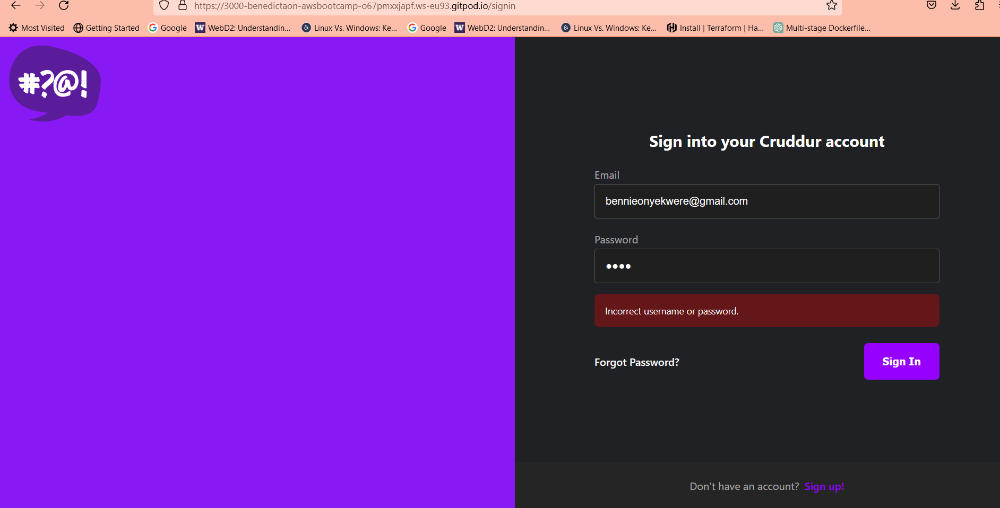
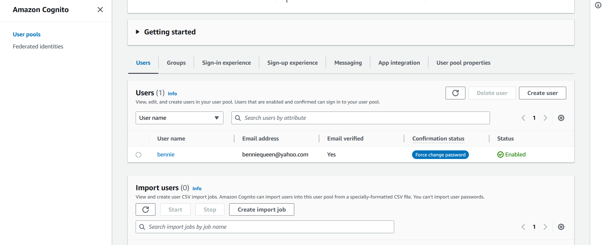
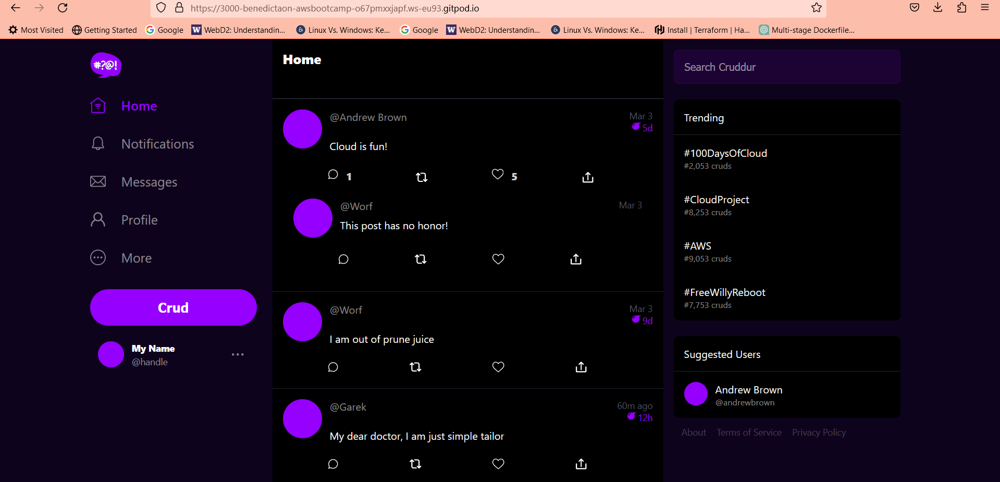
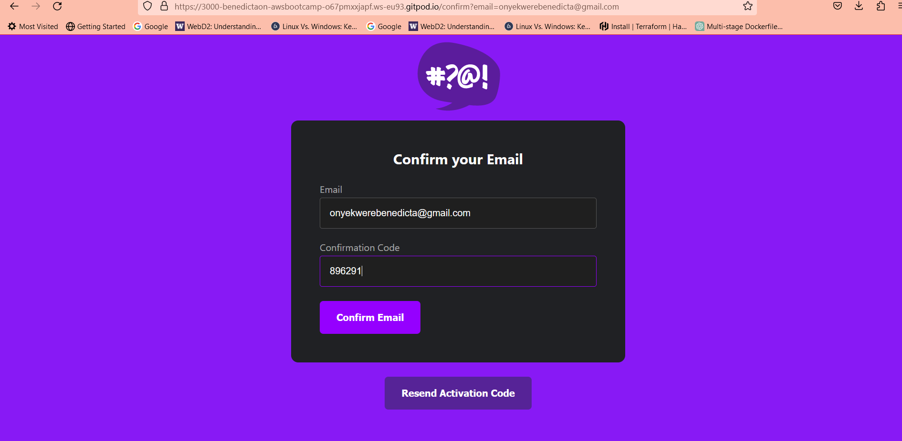
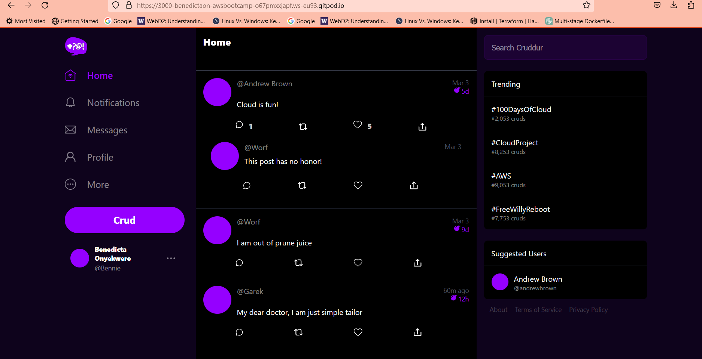
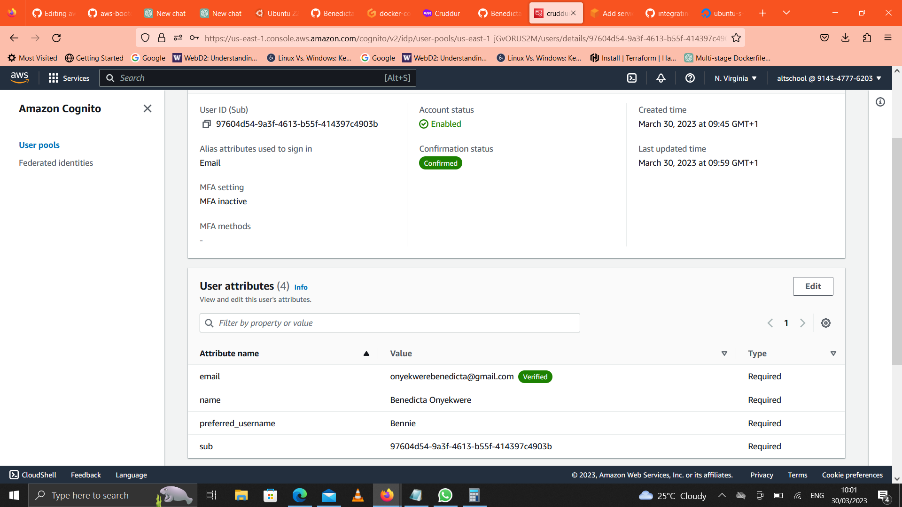
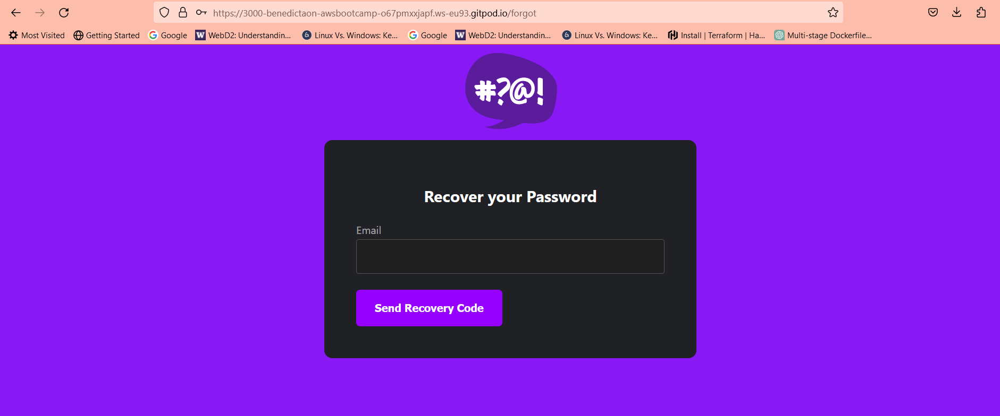
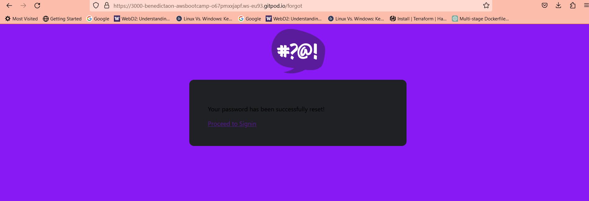

# Week 3 — Decentralized Authentication

### Provision Cognito User Group
Using the AWS Console I created a Cognito User Group

-I installed AWS Amplify Library which gets saved in `package.json` file.

`npm i aws-amplify --save`

### Configure Amplify
I installed AWS Amplify by importing it into my source in `App.js` file in frontend-react.js
```
import { Amplify } from 'aws-amplify';

Amplify.configure({
  "AWS_PROJECT_REGION": process.env.REACT_APP_AWS_PROJECT_REGION,
  "aws_cognito_identity_pool_id": process.env.REACT_APP_AWS_COGNITO_IDENTITY_POOL_ID,
  "aws_cognito_region": process.env.REACT_APP_AWS_COGNITO_REGION,
  "aws_user_pools_id": process.env.REACT_APP_AWS_USER_POOLS_ID,
  "aws_user_pools_web_client_id": process.env.REACT_APP_CLIENT_ID,
  "oauth": {},
  Auth: {
    // We are not using an Identity Pool
    // identityPoolId: process.env.REACT_APP_IDENTITY_POOL_ID, // REQUIRED - Amazon Cognito Identity Pool ID
    region: process.env.REACT_AWS_PROJECT_REGION,           // REQUIRED - Amazon Cognito Region
    userPoolId: process.env.REACT_APP_AWS_USER_POOLS_ID,         // OPTIONAL - Amazon Cognito User Pool ID
    userPoolWebClientId: process.env.REACT_APP_AWS_USER_POOLS_WEB_CLIENT_ID,   // OPTIONAL - Amazon Cognito Web Client ID (26-char alphanumeric string)
  }
});
```
Added the Environment Variables to my docker-compose.yml file
```
REACT_APP_AWS_PROJECT_REGION: "${AWS_DEFAULT_REGION}"
REACT_APP_AWS_COGNITO_REGION: "${AWS_DEFAULT_REGION}"
REACT_APP_AWS_USER_POOLS_ID: "us-east-1_laqLrWt7f"
REACT_APP_CLIENT_ID: "3s8ud11v2rq5iob7kb5ugon451"
```
### Conditionally show components based on logged in or logged outConditionally show components based on logged in or logged out
- Still in source folder,went to pages in the frontend-react.js, added the following codes in `HomeFeedPage.js`:
```
import { Auth } from 'aws-amplify';

// set a state
const [user, setUser] = React.useState(null);

// check if we are authenicated
const checkAuth = async () => {
  Auth.currentAuthenticatedUser({
    // Optional, By default is false. 
    // If set to true, this call will send a 
    // request to Cognito to get the latest user data
    bypassCache: false 
  })
  .then((user) => {
    console.log('user',user);
    return Auth.currentAuthenticatedUser()
  }).then((cognito_user) => {
      setUser({
        display_name: cognito_user.attributes.name,
        handle: cognito_user.attributes.preferred_username
      })
  })
  .catch((err) => console.log(err));
};

// check when the page loads if we are authenicated
React.useEffect(()=>{
  loadData();
  checkAuth();
}, [])
```
- Updated the `ProfileInfo.js` file inside of components folder with:
```
import { Auth } from 'aws-amplify';

const signOut = async () => {
  try {
      await Auth.signOut({ global: true });
      window.location.href = "/"
  } catch (error) {
      console.log('error signing out: ', error);
  }
}
```
- Ran docker compose up just to be sure it doesnt throw errors, it did made necessary corrections and it worked.
- 
### Implemented Signin Page
- Updated `SigninPage.js` in pages folder with:
```
import { Auth } from 'aws-amplify';

const onsubmit = async (event) => {
  setCognitoErrors('')
  event.preventDefault();
  try {
    Auth.signIn(email, password)
      .then(user => {
        localStorage.setItem("access_token", user.signInUserSession.accessToken.jwtToken)
        window.location.href = "/"
      })
      .catch(err => { console.log('Error!', err) });
  } catch (error) {
    if (error.code == 'UserNotConfirmedException') {
      window.location.href = "/confirm"
    }
    setCognitoErrors(error.message)
  }
  return false
}
```
- Refreshed browser to see if it worked it didnt, gave `Error! NotAuthorizedException:Incorrect username or password`in the inspect page not in the application . Then modidified above code and it then worked.
``` 
const onsubmit = async (event) => {
    setErrors('')
    console.log()
    event.preventDefault();
      Auth.signIn(email, password)
        .then(user => {
          localStorage.setItem("access_token", user.signInUserSession.accessToken.jwtToken)
          window.location.href = "/"
        })
        .catch(error =>{
      if (error.code == 'UserNotConfirmedException') {
        window.location.href = "/confirm"
      }
      setErrors(error.message)
    });
    return false
  }
  ```
  
  
  - Created a user using AWS console
  - Tried signing in user with password but it failed with same error of `Incorrect username or password`.
  - Using AWSCLI used the following code to change the User Status of `force change password` with the following code" and it worked.
  ```
  aws cognito-idp admin-set-user-password \
  --user-pool-id <your-user-pool-id> \
  --username <username> \
  --password <password> \
  --permanent
  ```
  
  
  
  
### Implemented Signup Page
- Updated the following code in `SignupPage.js`
```
import { Auth } from 'aws-amplify';

const onsubmit = async (event) => {
  event.preventDefault();
  setErrors('')
  try {
      const { user } = await Auth.signUp({
        username: email,
        password: password,
        attributes: {
            name: name,
            email: email,
            preferred_username: username,
        },
        autoSignIn: { // optional - enables auto sign in after user is confirmed
            enabled: true,
        }
      });
      console.log(user);
      window.location.href = `/confirm?email=${email}`
  } catch (error) {
      console.log(error);
      setErrors(error.message)
  }
  return false
}
```

### Implemented Confirmation Page
- Updated `ConfirmationPage.js` with:
```
import { Auth } from 'aws-amplify';

const resend_code = async (event) => {
  setErrors('')
  try {
    await Auth.resendSignUp(email);
    console.log('code resent successfully');
    setCodeSent(true)
  } catch (err) {
    // does not return a code
    // does cognito always return english
    // for this to be an okay match?
    console.log(err)
    if (err.message == 'Username cannot be empty'){
      setErrors("You need to provide an email in order to send Resend Activiation Code")   
    } else if (err.message == "Username/client id combination not found."){
      setErrors("Email is invalid or cannot be found.")   
    }
  }
}

const onsubmit = async (event) => {
  event.preventDefault();
  setErrors('')
  try {
    await Auth.confirmSignUp(email, code);
    window.location.href = "/"
  } catch (error) {
    setErrors(error.message)
  }
  return false
}
```
- Ran docker compose up didnt work due to checking both email and username when creating UserPool in AWS Cognito.
- Deleted user pool and created a new one checking the email box only.
- Copied and changed User Pool and Client Pool ID into my Environment Variables in my docker compose file.
- Ran docker compose up again and signed in, got a confirmation page, was sent an email with the confirmation code logged in and it worked.







### Implemented Recovery Page
Updated `RecoverPage.js` with:
```
import { Auth } from 'aws-amplify';

const onsubmit_send_code = async (event) => {
  event.preventDefault();
  setCognitoErrors('')
  Auth.forgotPassword(username)
  .then((data) => setFormState('confirm_code') )
  .catch((err) => setCognitoErrors(err.message) );
  return false
}

const onsubmit_confirm_code = async (event) => {
  event.preventDefault();
  setCognitoErrors('')
  if (password == passwordAgain){
    Auth.forgotPasswordSubmit(username, code, password)
    .then((data) => setFormState('success'))
    .catch((err) => setCognitoErrors(err.message) );
  } else {
    setCognitoErrors('Passwords do not match')
  }
  return false
}
```
- Clicked on Forgot password which took me to recover password page.
- Put in my email address. 
- It sent me a recovery code which i put in with a new password in the recover password page.
- Signed in again and it worked.



![[recover_password_page]](./assets/recover-password-signin-page.png)




